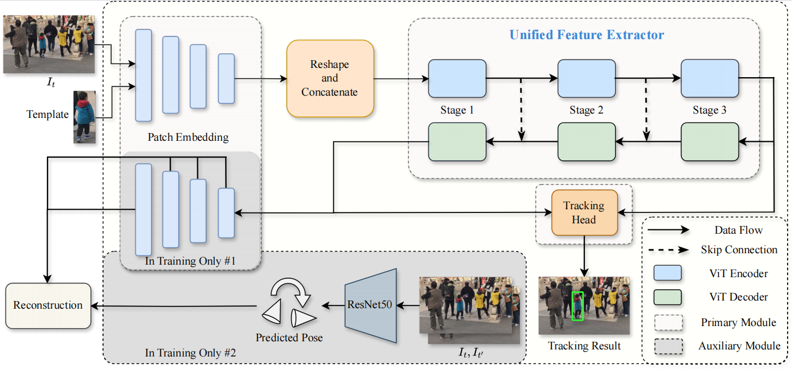








Lorem ipsum dolor sit amet, consectetur adipiscing elit. Vivamus ornare aliquet ipsum, ac tempus justo dapibus sit amet. Suspendisse condimentum, libero vel tempus mattis, risus risus vulputate libero, elementum fermentum mi neque vel nisl. Maecenas facilisis maximus dignissim. Curabitur mattis vulputate dui, tincidunt varius libero luctus eu. Mauris mauris nulla, scelerisque eget massa id, tincidunt congue felis. Sed convallis tempor ipsum rhoncus viverra. Pellentesque nulla orci, accumsan volutpat fringilla vitae, maximus sit amet tortor. Aliquam ultricies odio ut volutpat scelerisque. Donec nisl nisl, porttitor vitae pharetra quis, fringilla sed mi. Fusce pretium dolor ut aliquam consequat. Cras volutpat, tellus accumsan mattis molestie, nisl lacus tempus massa, nec malesuada tortor leo vel quam. Aliquam vel ex consectetur, vehicula leo nec, efficitur eros. Donec convallis non urna quis feugiat.

My research interest includes neural machine translation and computer vision. I have published more than 100 papers at the top international AI conferences with total <a href='https://scholar.google.com/citations?user=DhtAFkwAAAAJ'>google scholar citations <strong>260000+</strong></a> (You can also use google scholar badge ).

<!-- # 🔥 News
- *2022.02*: &nbsp;🎉🎉 Lorem ipsum dolor sit amet, consectetur adipiscing elit. Vivamus ornare aliquet ipsum, ac tempus justo dapibus sit amet. 
- *2022.02*: &nbsp;🎉🎉 Lorem ipsum dolor sit amet, consectetur adipiscing elit. Vivamus ornare aliquet ipsum, ac tempus justo dapibus sit amet.  -->

# 📝 Publications 

CVPR 2016

[Enhanced Object Tracking by Self-Supervised Auxiliary Depth Estimation Learning](../assets/images/Overview.png)

**Zhenyu Wei**, Yujie He, Zhanchuan Cai

[**Project**](https://scholar.google.com/) <strong></strong>
- Lorem ipsum dolor sit amet, consectetur adipiscing elit. Vivamus ornare aliquet ipsum, ac tempus justo dapibus sit amet. 

- [Lorem ipsum dolor sit amet, consectetur adipiscing elit. Vivamus ornare aliquet ipsum, ac tempus justo dapibus sit amet](https://github.com), A, B, C, **CVPR 2020**

<!-- # 🎖 Honors and Awards
- *2021.10* Lorem ipsum dolor sit amet, consectetur adipiscing elit. Vivamus ornare aliquet ipsum, ac tempus justo dapibus sit amet. 
- *2021.09* Lorem ipsum dolor sit amet, consectetur adipiscing elit. Vivamus ornare aliquet ipsum, ac tempus justo dapibus sit amet.  -->

# 📖 Educations
- *2022.09 - 2024.07 (now)*, Master of Science, Macau University of Science and Technology, School of Computer Science and Engineering, School of Innovative Engineering.
- *2018.09 - 2022.07*, Bachelor of Engineering, University of Jinan, Faculty of Information Science and Engineering.

<!-- # 💬 Invited Talks
- *2021.06*, Lorem ipsum dolor sit amet, consectetur adipiscing elit. Vivamus ornare aliquet ipsum, ac tempus justo dapibus sit amet. 
- *2021.03*, Lorem ipsum dolor sit amet, consectetur adipiscing elit. Vivamus ornare aliquet ipsum, ac tempus justo dapibus sit amet.  \| [\[video\]](https://github.com/) -->

# 💻 Internships
- *2022.03 - 2022.06*, [Inspur](https://www.inspur.com/), China.